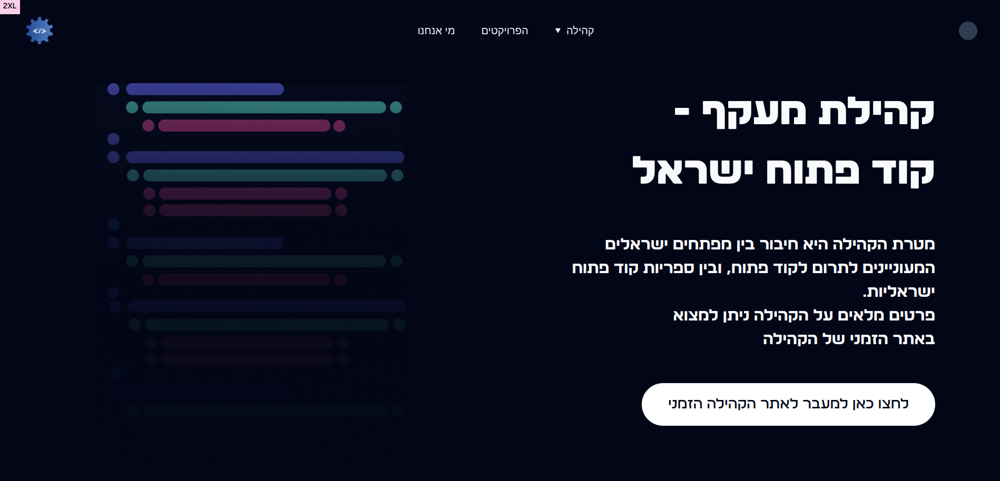

# מעקף - מחפשי עבודה (תורמים) לקוד פתוח

### Project Stack:

&nbsp;&nbsp;This is a Next.js project.
  
&nbsp;&nbsp;We're using TypeScript for type safety and better developer experience.
  
&nbsp;&nbsp;The UI is built using Tailwind CSS for rapid and responsive design.
  
&nbsp;&nbsp;Custom VSCode settings have been set up for a consistent development environment.
  

### Current State
- <a href="https://www.figma.com/file/qV5UBunxLQhqm41FfgRkmH/Maakaf?type=design&node-id=0-1&mode=design">Figma Characterization and design</a> is to be complete soon (Special thanks to our UI/UX designer - Efrat Sharon!)
- Development is ongoing! (Managed by <a href="https://github.com/RoyTennenbaum">@RoyTennenbaum</a> using <a href="https://github.com/orgs/Maakaf/projects/1">Github Projects</a>)
 

<h2>🚀 Forking and Running the Project</h2>

<h3>1. Fork the Repository</h3>
<ul>
    <li>Go to the GitHub repository you want to fork.</li>
    <li>Click the "Fork" button at the top right.</li>
</ul>

<h3>2. Clone Your Forked Repository</h3>
<pre><code>git clone https://github.com/YOUR_USERNAME/REPOSITORY_NAME.git</code></pre>

Replace <code>YOUR_USERNAME</code> and <code>REPOSITORY_NAME</code> accordingly.

<h3>3. Navigate to the Project Directory</h3>
<pre><code>cd REPOSITORY_NAME</code></pre>

<h3>4. Install Dependencies</h3>
<pre><code>npm install</code></pre>

<h3>5. Run the Project</h3>
<pre><code>npm run dev</code></pre>

Visit <a href="http://localhost:3000">http://localhost:3000</a> in your browser.

 

<h2>📦 VSCode Plugin Recommendation</h2>

For an enhanced development experience with Tailwind CSS, consider installing the <strong>Tailwind CSS IntelliSense</strong> extension in VSCode:

<ol>
    <li>Open VSCode.</li>
    <li>Press <code>Ctrl+Shift+X</code> or click the Extensions icon.</li>
    <li>Search for "Tailwind CSS IntelliSense".</li>
    <li>Click "Install".</li>
</ol>
